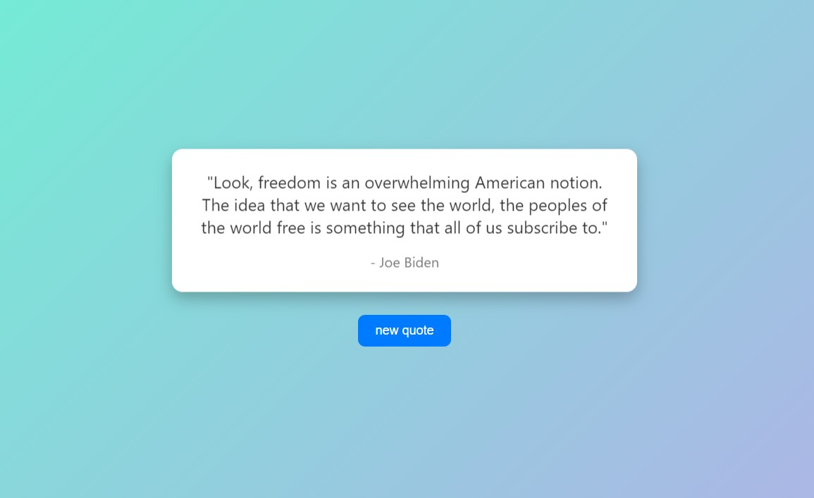

# 🎯 Quote Generator

A simple and elegant quote generator built with HTML, CSS, and JavaScript. It uses an external API to fetch random inspirational quotes and display them to the user.



## 🚀 Features

- Fetches a new random quote with each click
- Responsive and modern UI
- Arabic language interface with right-to-left layout
- Powered by [API Ninjas](https://api-ninjas.com/api/quotes)

## 🛠️ Technologies Used

- HTML5
- CSS3
- JavaScript (Fetch API)
- [API Ninjas Quotes API](https://api-ninjas.com/api/quotes)

## 📦 How to Run Locally

1. **Clone the repository:**
   ```bash
   git clone https://github.com/your-username/quote-generator.git
   cd quote-generator
